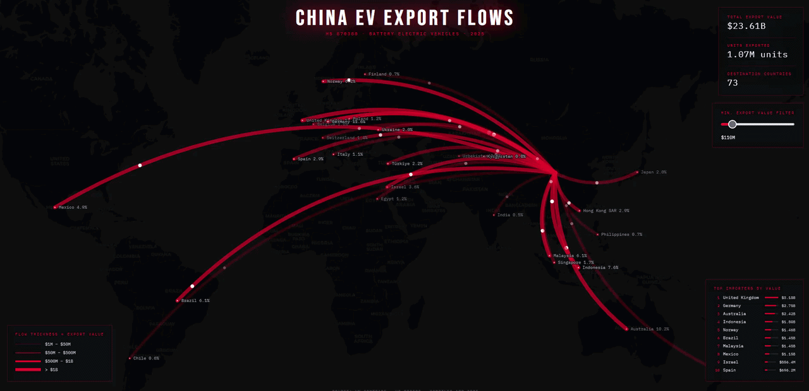

# China EV Export Flowmap (HS 870380)

An interactive, high-performance geospatial visualization of global Chinese Electric Vehicle (BEV) export flows for 2025. This project was developed as part of a Geoinformatics research focus, specifically exploring **HTML5 Canvas** rendering for complex spatial datasets.




## 🚀 Key Features

* **High-Performance Rendering**: Utilizes the HTML5 Canvas API to ensure smooth, 60fps rendering of flow arcs and animated particles, even with numerous data points.
* **Dynamic Visual Identity**: A custom "Cyberpunk" dark-themed UI featuring transparency, glow effects, and a responsive layout.
* **Interactive Data Filtering**: Integrated slider allowing users to filter destinations based on minimum export value to reduce visual clutter.
* **Real-time Analytics**: Dynamic calculation of market share percentages and total export metrics (Value, Quantity, Country Count).
* **Smooth Animations**: Implementation of "breathing" (fade in/out) animations for destination points and synchronized flow particles.

## 🛠 Tech Stack

* **Leaflet.js**: Core engine for cartographic display and coordinate projection.
* **HTML5 Canvas**: Advanced layer for high-speed animation of arcs and data labels.
* **D3.js**: Used for data processing and mathematical mapping of export values to visual scales.
* **CSS3**: Custom styling with Glassmorphism effects and specialized typography.

## 📊 Dataset Overview

The visualization represents export data sourced from the **UN Comtrade** database under the **HS 870380** code (Battery Electric Vehicles).
* **Total Export Value**: Over $23.6 Billion.
* **Total Units**: ~1.07 Million vehicles.
* **Scope**: 73 destination countries.

## 📂 Project Structure

* `index.html` - UI structure, dashboard panels, and external library links.
* `style.css` - Visual theme, animations, and responsive design rules.
* `script.js` - Data logic, Canvas rendering engine, and interaction handlers.

## 🔧 Getting Started

1.  **Clone the repository**:
    ```bash
    git clone [https://github.com/your-username/china-ev-export-flowmap.git](https://github.com/your-username/china-ev-export-flowmap.git)
    ```
2.  **Run the project**:
    Simply open `index.html` in any modern web browser. No local server or build process is required as it uses CDN-hosted libraries.

---
